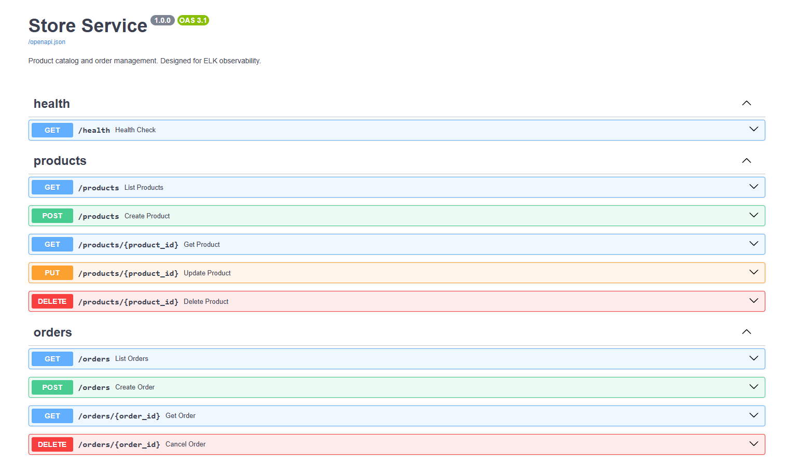
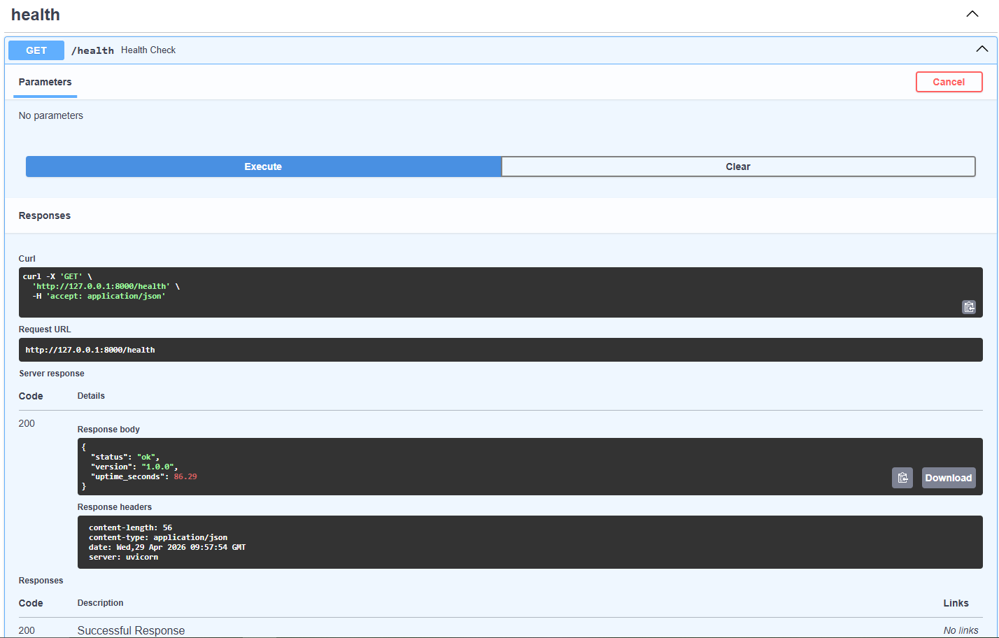
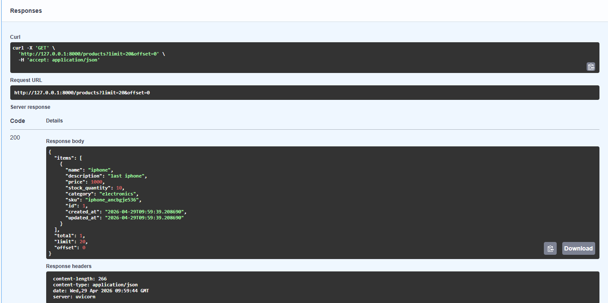
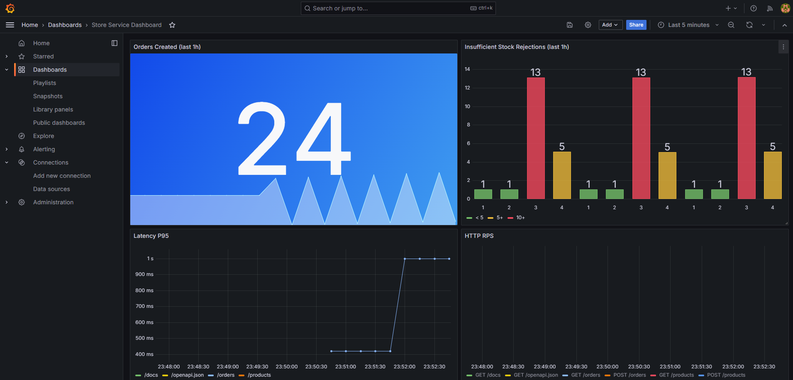
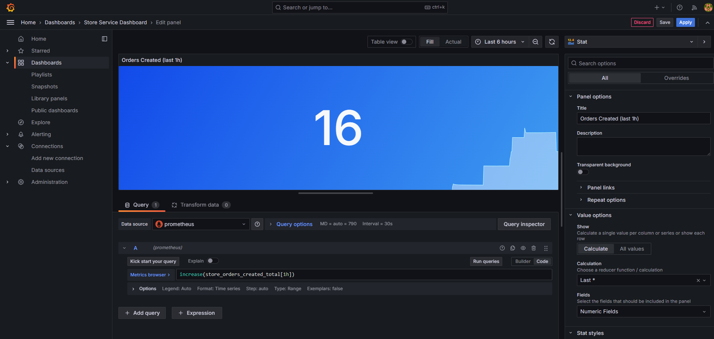
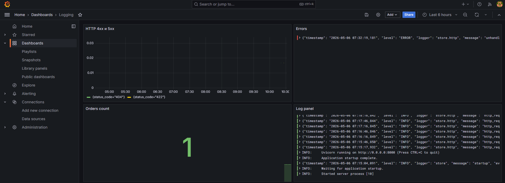
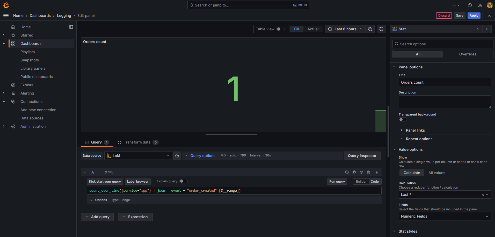
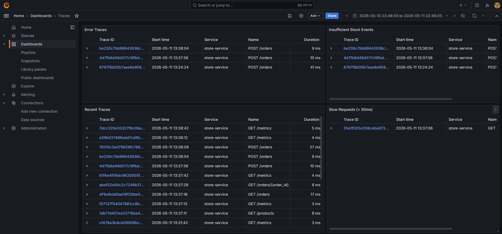
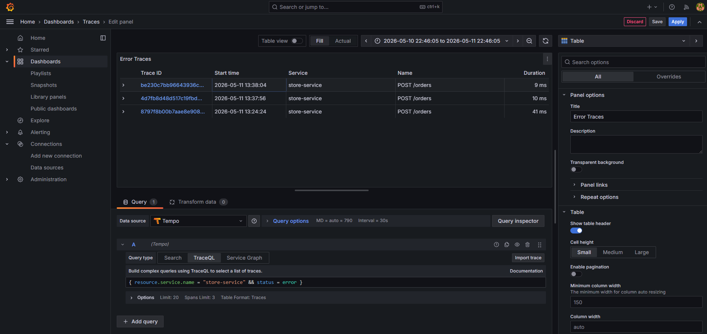

# Store Service — Лабораторная работа по ИСРПО

Учебный backend-сервис на **FastAPI**, реализующий каталог товаров и управление заказами.
Разработан с применением **API-first подхода**: спецификация OpenAPI является единственным источником истины для схем данных.

---

## Стек

| Компонент | Технология |
|---|---|
| Фреймворк | FastAPI 0.136+ |
| ORM | SQLAlchemy 2.0 (async) |
| СУБД | SQLite / aiosqlite |
| Валидация | Pydantic v2 |
| Сервер | Uvicorn |
| Менеджер пакетов | uv |


## API-first подход

### Шаг 1 — Спецификация как контракт (`openapi/spec.yaml`)

Весь API описан в формате **OpenAPI 3.0** до написания какого-либо Python-кода.
В спецификации явно зафиксированы:

- все эндпоинты, HTTP-методы и параметры;
- схемы запросов и ответов с ограничениями (`minLength`, `minimum`, `enum` и т.д.);
- коды ответов и структура ошибок (`ErrorResponse` с полем `error` — машиночитаемый код).

Пример: поле `price` в схеме `ProductBase` описано как `minimum: 0.01` прямо в spec.yaml — это ограничение автоматически превратится в валидатор Pydantic на следующем шаге.

### Шаг 2 — Кодогенерация Pydantic-моделей

Из спецификации генерируется файл `app/schemas/generated.py` с Pydantic v2 моделями:

```bash
uv run datamodel-codegen \
    --input openapi/spec.yaml \
    --input-file-type openapi \
    --output app/schemas/generated.py \
    --target-python-version 3.12 \
    --use-annotated \
    --field-constraints \
    --use-standard-collections \
    --use-union-operator
```

Каждая схема из `components/schemas` в spec.yaml превращается в Pydantic-класс.
Например, из этого фрагмента спецификации:

```yaml
ProductBase:
  type: object
  required: [name, price, category]
  properties:
    name:
      type: string
      minLength: 1
      maxLength: 255
    price:
      type: number
      minimum: 0.01
```

генерируется:

```python
class ProductBase(BaseModel):
    name: Annotated[str, Field(min_length=1, max_length=255)]
    price: Annotated[float, Field(ge=0.01)]
    ...
```

Файл `generated.py` **не редактируется вручную** — он всегда перезаписывается из spec.yaml.
Единственное исключение: у классов `Product` и `OrderItem` вручную добавлен
`model_config = ConfigDict(from_attributes=True)` для совместимости с SQLAlchemy ORM.

### Шаг 3 — Реализация поверх сгенерированного контракта

Весь остальной код пишется уже по готовому контракту:

```
openapi/spec.yaml  ──codegen──▶  app/schemas/generated.py
                                         │
                                         ├── app/routers/      (FastAPI: request/response types)
                                         └── app/services/     (бизнес-логика: входные DTO)

app/models/orm.py  ──────────────────────────────────────────  (SQLAlchemy: независимо от Pydantic)
```

ORM-модели (`app/models/orm.py`) и Pydantic-схемы существуют **независимо** — это намеренное разделение. Маппинг между ними происходит в сервисном слое через `Model.model_validate(orm_obj, from_attributes=True)`, что позволяет менять структуру БД без влияния на API-контракт и наоборот.

### Рабочий процесс при изменении API

```
1. Изменить openapi/spec.yaml
2. Запустить кодогенерацию (команда выше)
3. Исправить ошибки типов в сервисах/роутерах — компилятор укажет на несоответствия
4. Обновить ORM-модели и миграции БД при необходимости
```

Такой порядок гарантирует, что изменение контракта не останется незамеченным в коде.

---

## Запуск

### Локально (только FastAPI)

```bash
# 1. Установить зависимости
uv sync

# 2. Скопировать файл переменных окружения и заполнить значения
cp .env.example .env

# 3. Запустить (БД создаётся автоматически при старте)
uv run uvicorn app.main:app --reload

# Документация: http://localhost:8000/docs
```

### Docker Compose (FastAPI + Prometheus + Grafana)

```bash
# 1. Скопировать файл переменных окружения и заполнить значения
cp .env.example .env

# 2. Собрать и запустить весь стек
docker compose up --build

# Остановить стек
docker compose down
```

| Сервис | URL |
|---|---|
| FastAPI docs | http://localhost:8000/docs |
| Метрики (raw) | http://localhost:8000/metrics |
| Prometheus UI | http://localhost:9090 |
| Grafana | http://localhost:3000 |

---

## Лабораторная 2 — Создание сервиса







---

## Лабораторная 3 — Метрики




## Лабораторная 4 — Журналирование




## Лабораторная 5 — Распределенная трасировка



